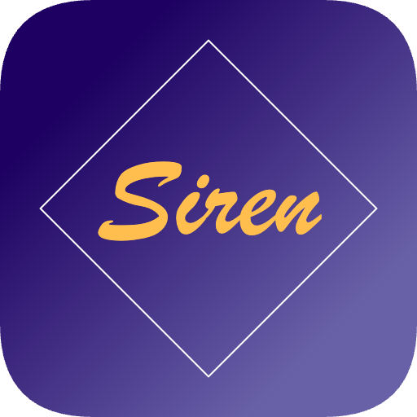

<p align="center">
  
</p>

<h1 align="center">Siren</h1>

<p align="center">
  A beautiful, native Mermaid diagram viewer for macOS.<br>
  Smooth zoom & pan like Figma. Dark mode. Minimal and fast.
</p>

<p align="center">
  <a href="https://github.com/fuwasegu/siren/releases/latest">Download</a>
</p>

---

## Features

- **Figma-like canvas** — Smooth pinch-to-zoom and pan with trackpad or mouse
- **Dark & Light mode** — Switch between dark, light, or auto (follows system)
- **Dot grid background** — Adaptive grid that scales with zoom level
- **Minimap** — Always see where you are in the diagram
- **Drag & drop** — Open `.mermaid` or `.mmd` files by dropping them onto the window
- **SVG export** — Download your rendered diagram as SVG
- **Keyboard shortcuts** — `Cmd+O` open, `Cmd+/-` zoom, `Cmd+0` fit to view, `Cmd+T` toggle theme

## Install

### Homebrew

```
brew install fuwasegu/tap/siren
```

### Manual

Download the latest `.zip` from [Releases](https://github.com/fuwasegu/siren/releases/latest), unzip, and drag `Siren.app` to your Applications folder.

## Supported Diagrams

Siren renders all diagram types supported by [Mermaid.js](https://mermaid.js.org/) v11:

- Flowcharts
- Sequence diagrams
- Class diagrams
- State diagrams
- Entity Relationship diagrams
- Gantt charts
- Pie charts
- Git graphs
- and more

## Requirements

- macOS 13 (Ventura) or later

## License

MIT
